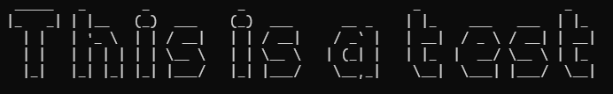

# Riglet 

Riglet is a Rust port of Figlet

# Examples

```
use riglet::riglet;

fn main() {
   let ascii = riglet::convert(String::from("This is a test"));
   riglet::print_ascii(ascii);
}
```



# Task list
- [X] Special characters 
- [ ] Diacritic characters
- [X] More documentation
- [ ] More fonts from figlet


